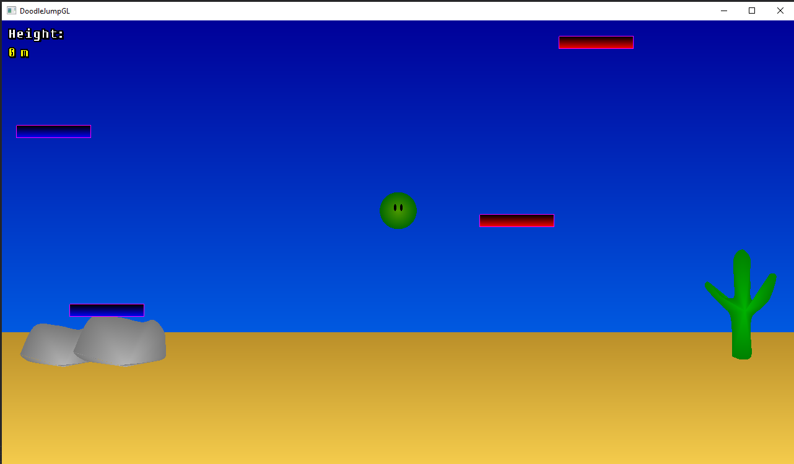
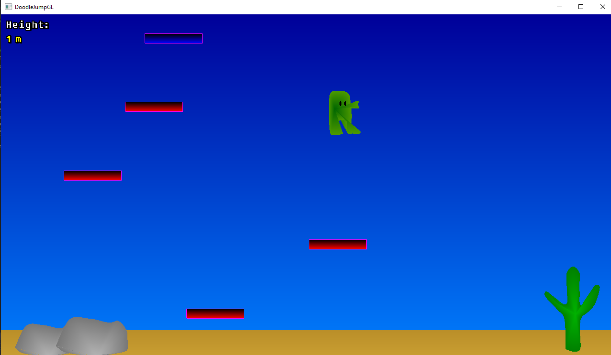

# doodleJumpGL

## What is this thing?!

This is the code for the first project for the Computer Graphics course at the University Of Bologna. The goal was to make an interactable 2D scene in OpenGL.
I decided to make a clone of the mobile game "DoodleJump", which is the perfect example of a simple yet fun game.

Some of the features of the original are missing (such as enemies and springs) due to time and complexity constraints.

## How to compile

This branch represents the <b>Windows version</b> of the code (which is essentially the same aside from some minor tweaks and the compilation method, as well as the whole VS2019 project file for easy compilation). You can check the Linux version of the code [here](https://github.com/AngeloGalav/doodleJumpGL/tree/linux).

To compile and run in Windows, simply open the `doodino.sln` project file and press the "compile" button (the green triangle, y'know).

## Dependencies

This project uses the following libraries:
<ul>
<li>freeGLUT - an implementation of GLUT</li>
<li>GLEW </li>
<li>glm - the openGL math library</li>
</ul>

All 3 can be easily downloaded with `nuget` by installing the `nupengl.core` package.

The project also uses two additional libraries: `json.hpp` and `gltext.h`, which are both included in the project. 

## How do you play this darn game?!

You simply press `a` to go left and `d` to go right. The goal is to reach the highest point possible. If you die, you can simply press `r` to restart (as prompted). 

## Known issues

Here are some of the known issues with this version, which hopefully will get fixed in the next version:
<ul>
<li>The game does NOT recognize capital 'A', 'D' or 'R' as input. Check if Caps Lock is enabled. </li>
<li>The collisions with the platforms are a bit wonky.</li>
<li>Some of the Hermite meshes are slightly broken.</li>
<li>On Windows, there could be some problems with the graphics card driver (i.e. the igdumd64.dll access error). This is due to the nupengl library, so I recommend installing freeglut and GLEW manually.</li>
</ul>

## Additional things

The game features a debug mode, which shows the main character's colliders, as well as additional info on the game on the stdout.
Also, there's a special Mesh for the character made with an Hermite curve, which is disabled by default.  
Both of these features can be enabled by modifying their respective macros in `Definitions.h`.

## Scheenshots

<figure>

    <i>A normal gameplay session.</i>

</figure>

<figure>

    <i>The special character mesh. It's disabled by default 'cause I like the first one better. </i>

</figure>
